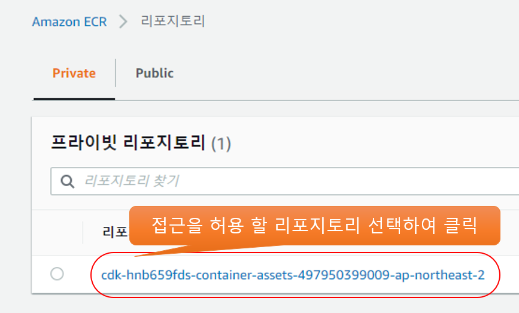
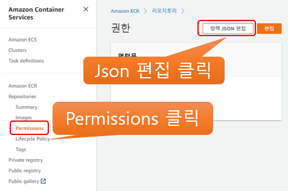

# ECR is in different AWS account

다른 계정에서 ECR에 접근 할 수 있게 설정하는 방법

## ECR Permission 변경

- [ECR](https://console.aws.amazon.com/ecr)
- Repositories Permissions Json 편집화면 열기
  
  

- 정책 편집

```json
{
  "Version": "2012-10-17",
  "Statement": [
    {
      "Effect": "Allow",
      "Principal": {
        "AWS": "arn:aws:iam::123456789012:role/eksctl-cross-account-ecr-access-n-NodeInstanceRole"
      },
      "Action": [
        "ecr:GetAuthorizationToken",
        "ecr:BatchCheckLayerAvailability",
        "ecr:GetDownloadUrlForLayer",
        "ecr:GetRepositoryPolicy",
        "ecr:DescribeRepositories",
        "ecr:ListImages",
        "ecr:DescribeImages",
        "ecr:BatchGetImage",
        "ecr:GetLifecyclePolicy",
        "ecr:GetLifecyclePolicyPreview",
        "ecr:ListTagsForResource",
        "ecr:DescribeImageScanFindings"
      ],
      "Resource": "*"
    }
  ]
}
```

Principal 예제

- 타 계정 `123456789012`의 모든 사용자의 접근을 허용

    ```json
    "Principal": {
        "AWS": "arn:aws:iam::123456789012:root"
    },
    ```

- 타 계정 `123456789012`의 특정 IAM Role(`eksctl-cross-account-ecr-access-n-NodeInstanceRole`)의 접근을 허용

    ```json
    "Principal": {
        "AWS": "arn:aws:iam::123456789012:role/eksctl-cross-account-ecr-access-n-NodeInstanceRole"
    },
    ```

- 타 계정 `123456789012`의 특정 사용자(`abc`)의 접근을 허용

    ```json
    "Principal": {
        "AWS": "arn:aws:iam::123456789012:user/abc"
    },
    ```

- 타 계정 `123456789012`와 `234567890123`의 접근을 허용

    ```json
    "Principal": {
        "AWS": [
            "arn:aws:iam::123456789012:root",
            "arn:aws:iam::234567890123:root"
        ]
    },
    ```
